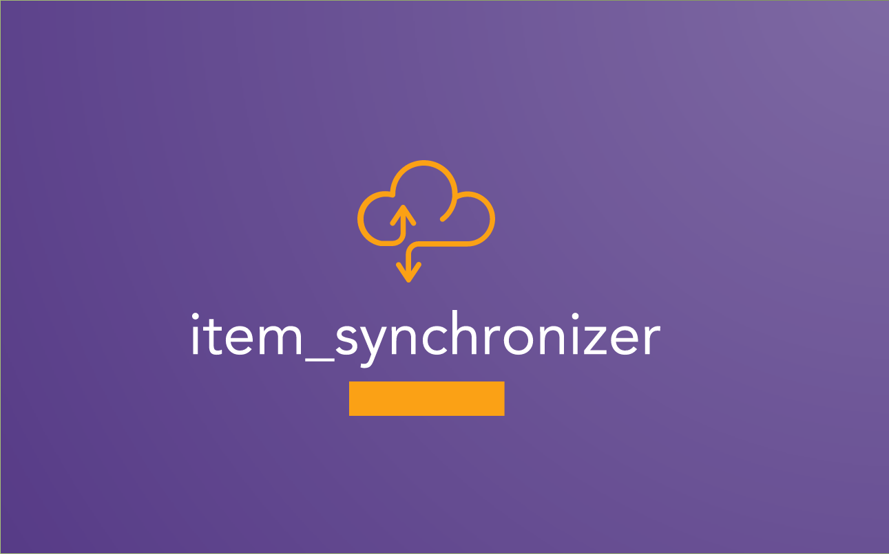
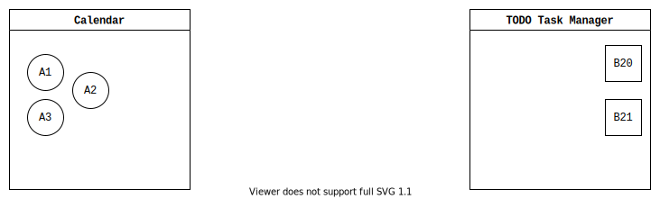
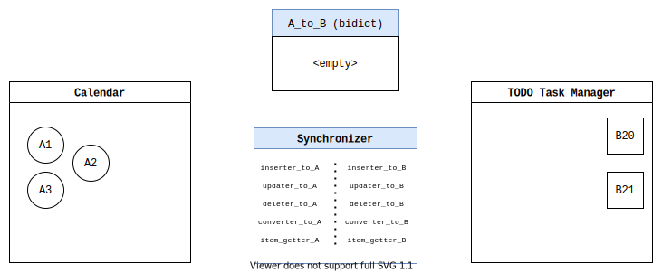
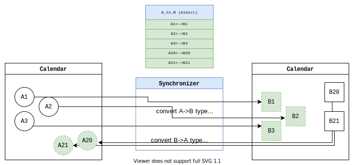
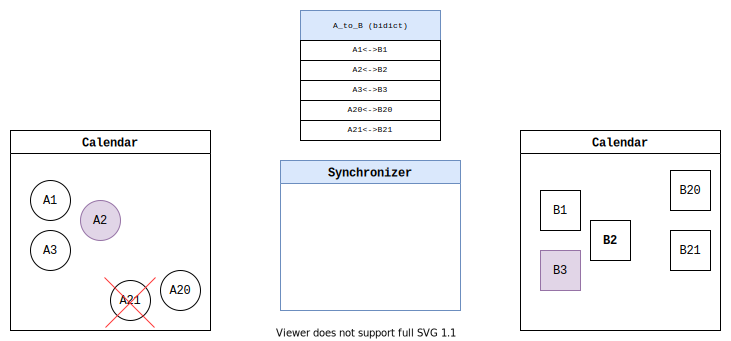
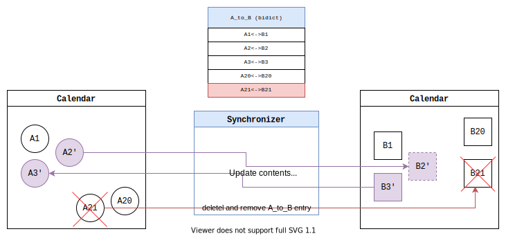
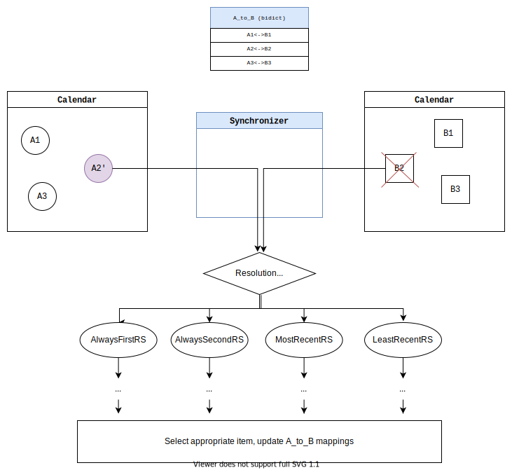

# Item Synchronizer



<a href="https://github.com/bergercookie/item_synchronizer/actions" alt="CI">
</a>
<a href="https://github.com/pre-commit/pre-commit">

</a>
<a href="https://www.codacy.com/app/bergercookie/item_synchronizer">
</a>
<a href="https://www.codacy.com/app/bergercookie/item_synchronizer">
</a>
<a href="https://github.com/bergercookie/item_synchronizer/blob/master/LICENSE.md" alt="LICENCE">
</a>
<a href="https://pypi.org/project/item_synchronizer/" alt="pypi">
</a>
<a href="https://badge.fury.io/py/item-synchronizer">
</a>
<a href="https://pepy.tech/project/item-synchronizer">
</a>
<a href="https://github.com/psf/black">
</a>

## Description

Synchronize items from two different sources in a bidirectional manner.

This library aims to offer an abstract and versatile way to _create_, _update_
and/or _delete_ items to keep two "sources" in sync.

These "items" may range from Calendar entries, TODO task lists, or whatever else
you want as long as the user registers the appropriate functions/methods to
convert from one said item to another.

## Usage

The `Synchronizer` class requires the following `Callable`s to be given, for each
one of the sides. See the most up-to-date python types
[here](https://github.com/bergercookie/item_synchronizer/blob/master/item_synchronizer/types.py)

- Insertion callable: when called with the contents of an item it should create
  and return the ID of the newly added item on the other source
- Update callable: update an item given by the item ID, using the (possibly
  partial) new contents specified by Item
- Deletion callable: Delete the item given by the specified ID
- Conversion callable: convert an item from the format of one source to the
  format of another.
- `Item Getter` callable: Given the ID of an Item of one source return the
  corresponding item on the other source.
- `A_to_B` [bidict](https://github.com/jab/bidict)

  - This should be a bidict mapping IDs of A to the corresponding IDs of B and
    vice-versa. Given this the `item_synchronizer` is responsible for keeping
    it up to date on insertion, update and deletion events. The contents of this
    bidict should be persistent across the various runs, thus, consider
    pickle-ing and unpickling its contents to disk

Additionally `item_synchronizer` needs to know what items (their IDs) were
inserted, updated and deleted during the call to its main method, `sync()`. This
is dependent on your application at hand. You could either cache the items and
their content after each run and compare them with the latest state in the
current run. Or, the API of the calendar/task manager, etc. that you are using
may allow you to query the items that were modified/inserted/deleted since the
last run.

## Examples

Let's say you want to bi-directionally synchronize your calendar events with
your TODO Task Manager tasks. This way, when you remove calendar event, the
correspoding task will be deleted, when you add a new task in your task manager,
a new calendar event will be created and when you update the task (e.g., change
its description or start time) the changes will reflect in the corresponding
calendar entry.

Thus, you have the following and you want to sync the `A` and `B` items.



As described in the previous section, `item_synchronizer` requires a set of
functions which it will call when it needs to insert, update or delete an item
from the corresponding side. It also requires an `A_to_B` bidict persistent
across its runs with the item mappings between the two sides before the very
latest changes. Notice that, `item_synchonizer` will be responsible for updating
entries in this `A_to_B` bidict, you do not need to do that manually. You only
need to make it persist across the different runs of the `Synchronizer.sync()`
call (e.g., by pickle-ing and unpickle-ing it every time your application exits
and starts again.)

Thus, this is the situation that `item_synchronizer` expects at its first
run.



After the first call to `sync()` here's the expected results. After this call
each event of one side will have a counterpart on the other side and that's also
going to be reflected in the provided `A_to_B` bidict.



Subsequent calls to `sync()` will pick up the changes and will insert any new
items from each side to the other side accordingly.

Now let's say that item 2 was modified from side A, item 3 from side B and
item 21 was deleted from side A.



In the subsequent call to `sync()`, `item_synchronizer` will forward these
changes to the other side appropriately.



If there was a conflict, e.g., an item removed from one side and updated from
the other, then `item_synchronizer` supports a series of resolution strategies
for handling such conflicts.



## Installation

Add it as a dependency to either your `requirements.txt` or to `pyproject.toml`

```console
[tool.poetry.dependencies]
...
item_synchronizer = "^1.0"
...
```

Or simply install it with `pip` if you want to use it locally:

```sh
pip3 install item_synchronizer
```

## Projects using it

Projects using this:

- [Taskwarrior <-> Google Calendar Bidirectonal Synchronisation](https://github.com/bergercookie/taskw_gcal_sync/blob/master/taskw_gcal_sync/TWGCalAggregator.py)

## Notes

- Currently IDs of items on either side should be of `str` type.
